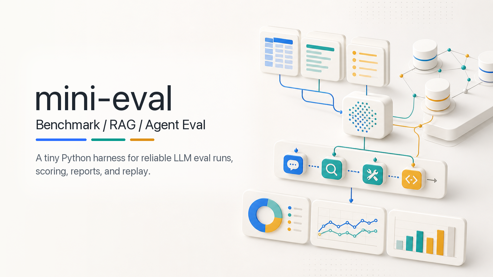

# mini-eval-harness



A small evaluation harness for learning three eval workflows:

- model benchmark eval
- RAG application eval
- agent trajectory eval

## Install

Option A: venv

```bash
python -m venv .venv
source .venv/bin/activate

python -m pip install -U pip
python -m pip install -e .
```

Optional extras:

```bash
python -m pip install -e ".[hf]"     # local Hugging Face models
python -m pip install -e ".[ragas]"  # Ragas evaluator
python -m pip install -e ".[dev]"    # type checks
```

Option B: uv

```bash
uv sync
```

Optional extras:

```bash
uv sync --extra hf
uv sync --extra ragas
uv sync --extra dev
```

## Run

With activated venv:

```bash
mini-eval run configs/mock.yaml
```

With uv:

```bash
uv run mini-eval run configs/mock.yaml
```

Other configs:

```bash
export DEEPSEEK_API_KEY="..."

mini-eval run configs/gsm8k.yaml
mini-eval run configs/rag.yaml
mini-eval run configs/agent.yaml
```

List configs:

```bash
mini-eval configs
```

Replay an agent failure:

```bash
mini-eval replay results/run_agent_mock.jsonl agent_010
```

If you use uv, prefix commands with `uv run`, for example `uv run mini-eval configs`.

## Configs

```text
configs/mock.yaml   # mock QA smoke test
configs/gsm8k.yaml  # GSM8K subset, HF model
configs/rag.yaml    # RAG QA, DeepSeek API
configs/agent.yaml  # agent tasks, DeepSeek API
```

To run RAG or Agent with the mock model:

```bash
mini-eval run configs/rag.yaml --model-provider mock --run-id rag_mock
mini-eval run configs/agent.yaml --model-provider mock --run-id agent_mock
```

## Outputs

Each run writes:

```text
results/run_<run_id>.jsonl
results/run_<run_id>_config.yaml
reports/run_<run_id>.md
```

`results/` and `reports/` are ignored by git.

## Project Layout

```text
src/mini_eval_harness/
  runner.py          # main eval runner
  model_adapter.py   # mock, OpenAI-compatible, HF adapters
  scorer.py          # QA/GSM8K scorers
  rag/               # RAG pipeline and evaluators
  agent/             # agent environment, trajectory, scorer, replay

configs/             # runnable eval configs
data/                # demo datasets
docs/rag_demo/       # small RAG knowledge base
prompts/             # YAML prompt specs (id, version, template)
```

## Checks

```bash
basedpyright
# or
uv run basedpyright
```

## Notes

- Use `.env.example` as a local API-key template.
- `data/gsm8k_test_50.jsonl` is a small GSM8K subset for demo purposes. GSM8K is available from [openai/grade-school-math](https://github.com/openai/grade-school-math) and [Hugging Face Datasets](https://huggingface.co/datasets/openai/gsm8k).
